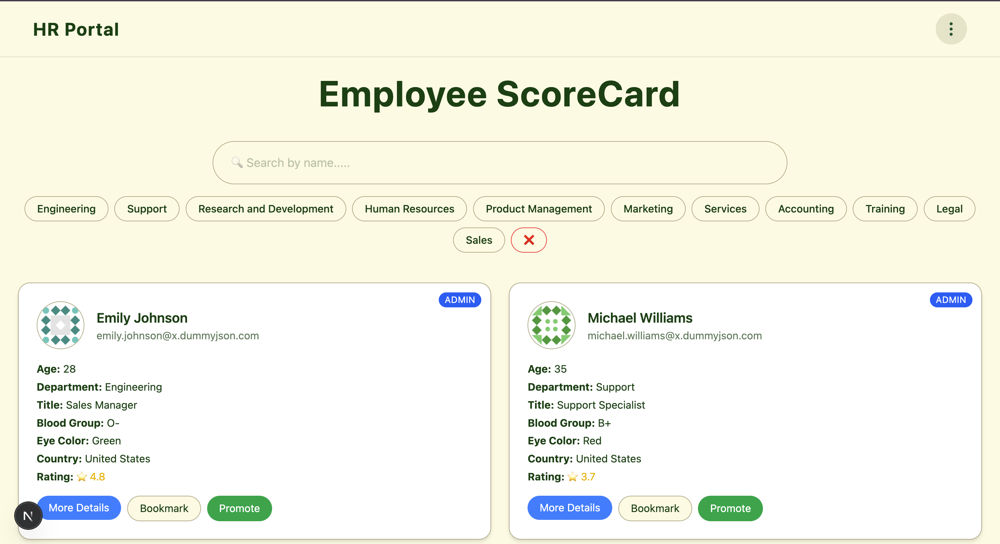
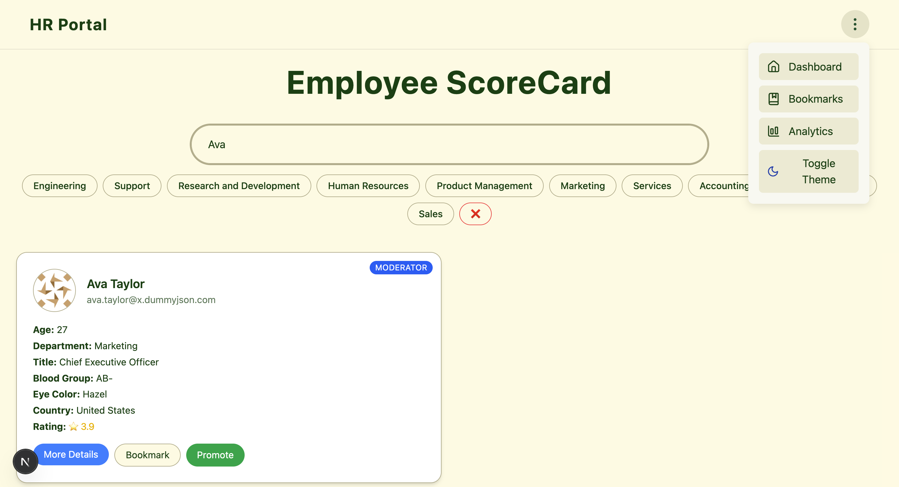
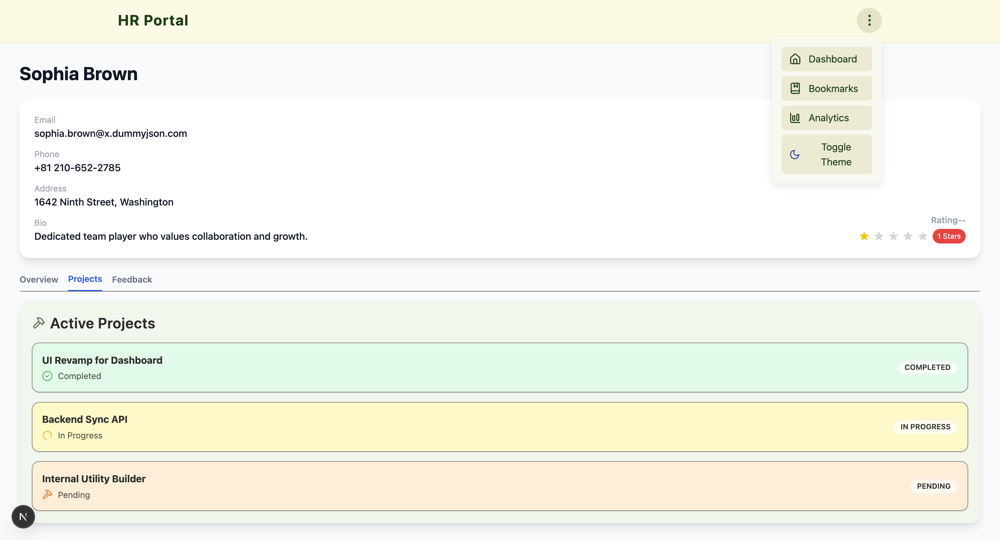
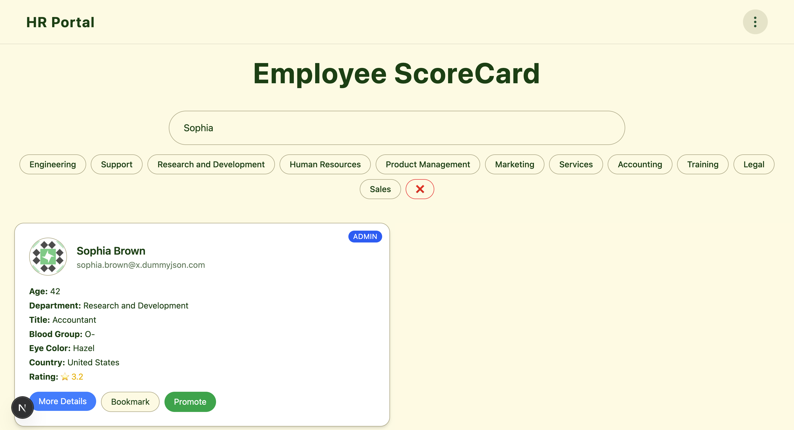
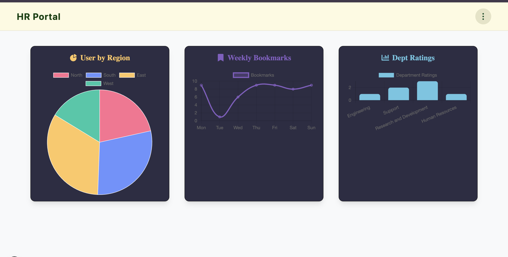
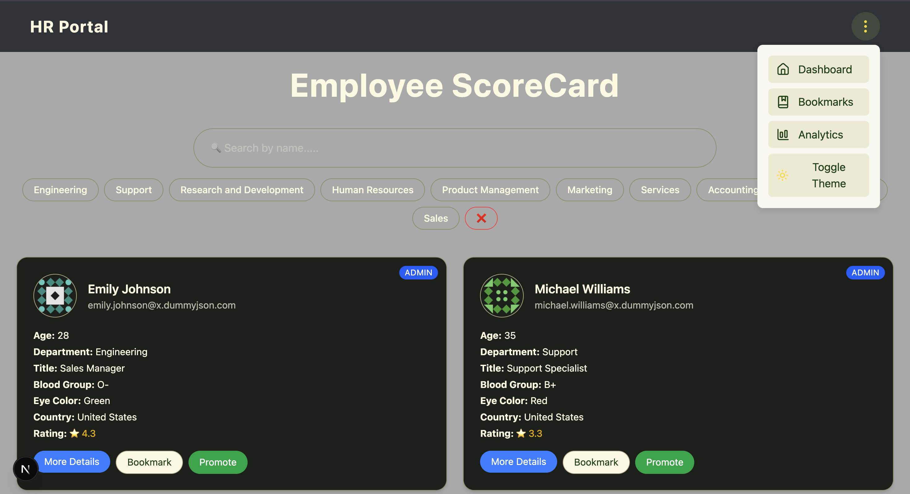

# 💼 HR Dashboard (Advanced)

An advanced HR performance dashboard built using **Next.js App Router**, **Tailwind CSS**, and **Context API**. Easily search, filter, bookmark, and analyze employee data with a sleek dark/light UI toggle.

---

## 🚀 Features

- 🔍 Search and filter employees by department
- 📌 Bookmark favorite employees
- 📊 View department & rating analytics (mock data)
- 🌗 Dark/Light mode toggle
- 🧑‍💼 Individual employee detail view with tabs
- ⚡ Built with modern UI components using Tailwind CSS

---

## 📸 Preview Screens

### 🧾 Dashboard (All Employees List)


### 🔍 Search + Filter by Department


### 🧑‍💼 Employee Info with Tabs (Overview, Projects, Feedback)


### 📌 Bookmarked Employees


### 📊 Analytics Dashboard


### 🌙 Theme Toggle (Dark/Light)


---

## 📦 Getting Started

```bash
# Clone the repository
git clone https://github.com/your-username/hr-dashboard.git

# Navigate to the folder
cd hr-dashboard

# Install dependencies
npm install

# Run the development server
npm run dev

# Open your browser at
http://localhost:3000
```

---

## 📤 Deployment

The easiest way to deploy is via [**Vercel**](https://vercel.com/new).

Alternatively, you can build and run locally:

```bash
npm run build
npm start
```
